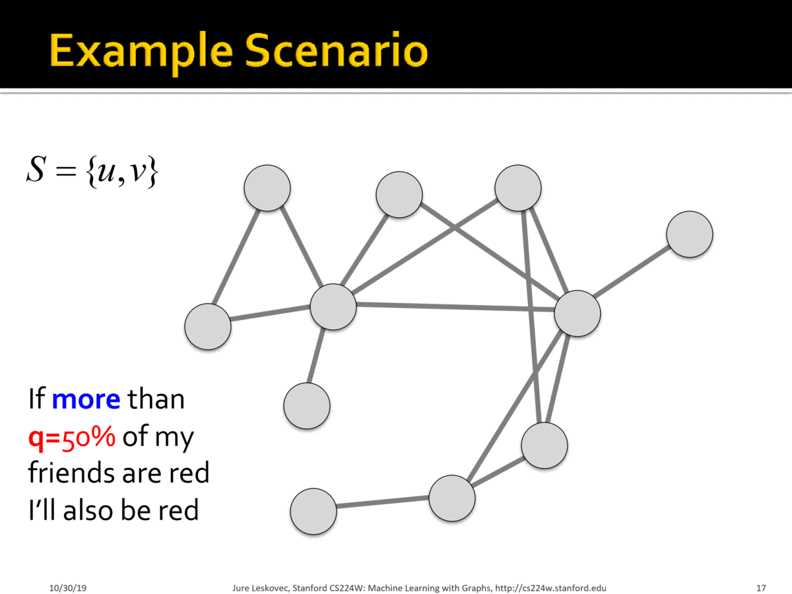
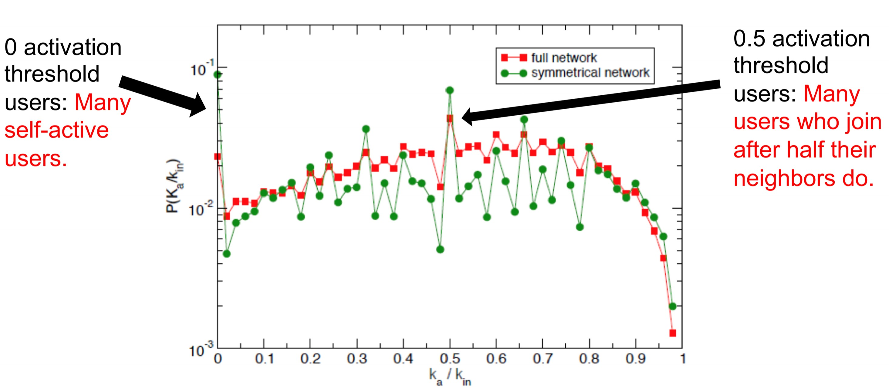
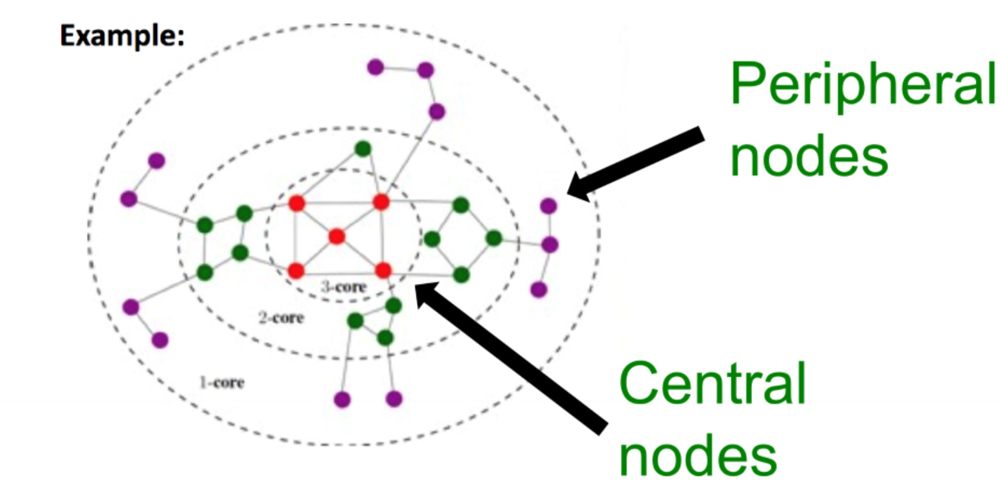
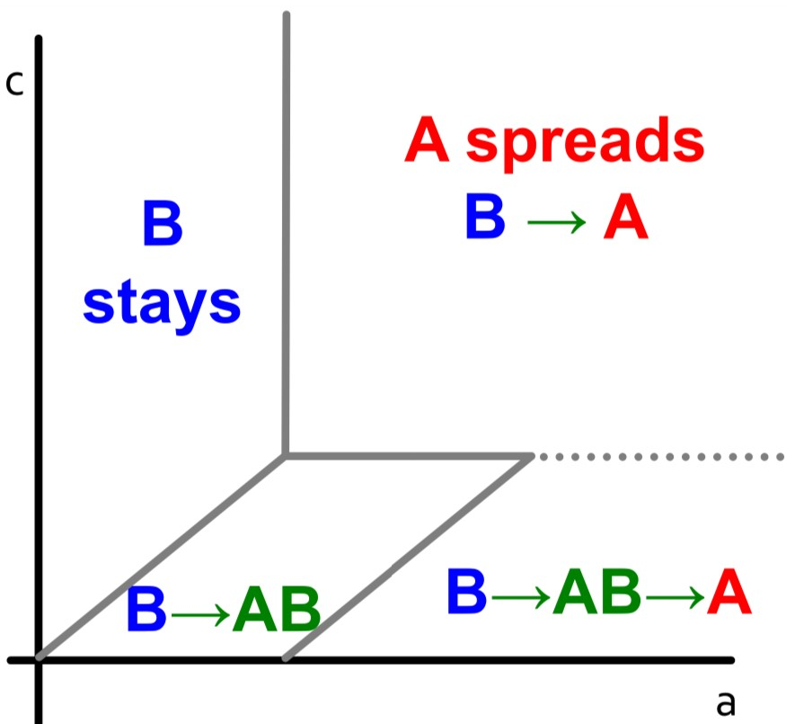

The phenomenon of spreading through networks and cascading behaviors is prevalent in a wide range of real networks.  Examples include contagion of diseases, cascading failure of technologies, diffusion of fake news, and viral marketing.  Formally, an **“infection” event** can spread **contagion** through **main players** (active/infected nodes) which constitute a propagation tree, known as a **cascade**. We will examine two model classes of diffusion:
- Decision-based: each node decides whether to activate based on its neighbors' decisions. Deterministic rule, nodes are active players, and suited for modeling adoption
- Probabilistic: infected nodes "push" contagion to uninfected nodes with some probability. Can involve randomness, nodes are passive, and suited for modeling epidemic spreading

# Decision Based Diffusion
## Game Theoretic Model of Cascades: single behavior adoption
The key intuition behind the game theoretic model is that a node will gain more payoff if its neighbors adopt the same behavior as it. An example is competing technological products: if your friends have the same type DVD players and discs (e.g. Blu-ray vs. HD DVD), then you can enjoy sharing DVDs with them.

Every node independently decides whether to adopt the contagion depending upon its neighbors. The decision is modelled as a two-player game between a node and a given neighbor. Hence a node with degree $$k$$ plays $$k$$ such games to evaluate its payoff and correspondingly its behavior. The total payoff is the sum of node payoffs over all games.

If there are two behavior $$A$$ and $$B$$ in the network and each node can adopt a single behavior, the payoff matrix for the two-player game is as follows:

|   | A | B |
|---|---|---|
| A | a | 0 |
| B | 0 | b |

where rows correspond to node $$v$$'s behavior, columns correspond to node $$w$$'s behavior, and entries represent each node's payoff.

Let's analyze a node with $$d$$ neighbors, and let $$p$$ be the fraction of nodes which have adopted $$A$$. The payoff for choosing $$A$$ is $$apd$$ and the payoff for choosing $$B$$ is $$b(1-p)d$$. Hence the node adopts behavior $$A$$ if the following is met: 
$$apd > b(1-p)d \implies p > \frac{b}{a+b}$$

We define $$q = \frac{b}{a+b}$$ to be the **threshold** fraction of a node's neighbors required for the node to choose $$A$$ i.e. requires $$p > q$$.

### Example:
Scenario:
- Graph where all nodes start with $$B$$
- Small set $$S$$ of early adopters of $$A$$. Hardwire this set such that these nodes will persistently use $$A$$ regardless of payoff
-Set $$a=b-\epsilon$$ and $$q = 0.5$$ for a small constant $$\epsilon>0$$. Interpretation: I adopt $$A$$ if more than 50% of my neighbors adopt $$A$$.

### Case Study: [Modelling Protest Recruitment on social networks](https://arxiv.org/abs/1111.5595)
Undirected network of Twitter users. 70 identified hashtags associated with 2011 Spain anti-austerity protests.
For each user (node):
- User activation time = moment when user starts tweeting protest messages
- $$k_{in}$$ = total number of neighbors at user activation time
- $$k_{a}$$ = number of activate neighbors at user activation time
- Activation threshold $$\frac{k_{a}}{k_{in}}$$ = fraction of neighbors that are active at user activation time

Key Insights:
- The distribution of activation threshold had two local peaks: i) at $$\frac{k_{a}}{k_{in}} \approx 0$$, indicating many self-active users who join with without social pressure ii) at $$\frac{k_{a}}{k_{in}} \approx 0.5$$ indicating many users join once half their neighbors have. Remainder of distribution mostly uniform.

- A "burst" of neighbors joining the movement has greater impact on users with high threshold and lesser impact on users with low threshold
- Most cascades were small
- Larger cascades were started by users with higher $$k$$-core number i.e. more central. The $$k$$-core is defined as the largest connected subgraph where every node has at least degree $$k$$ and can be evaluated by iteratively removing nodes with degree less than $$k$$.

## Extending Game Theoretic Model: multi-behavior adoption
A node can adopt both behaviors and become $$AB$$ by paying a cost $$c$$.  The resulting payoff matrix (without cost $$c$$ applied) is as follows:

|   | A | B | AB |
|---|---|---|----|
| A | a | 0 | a  |
| B | 0 | b | b  |
| AB| a | b | max(a,b)|

### Example: Infinite path graph 
Let us examine an infinite path graph where everyone begins with behavior/product $$B$$ except for three nodes of the following cases.  Let us also set $$b=1$$.

**Case 1**:**A-w-B** 

Payoffs for $$w$$: $$A: a$$, $$B: 1$$, $$AB: a+1-c$$

**Case 2**: **AB-w-B**

Payoffs for $$w$$: $$A: a$$, $$B: 1$$, $$AB: max(a, 1) + 1 -c$$

The graphs show how different regions of $$(a,c)$$ values impact the decision-based diffusion:
- B->A (Direct Conquest): If $$a$$ and $$c$$ are both high, then the cost of being compatible to both products is not worth it and conversion to $$A$$ is direct
- B->AB->A (Infiltration): If $$a$$ is high and $$c$$ is lower, users first transition to $$AB$$ before fully committing to $$A$$  

# Probabilistic Diffusion
## Epidemic Model based on Random Trees
## Basic Reproductive Number $$R_0$$
## S+E+I+R Models
### SIR
### SIS
### SEIZ
### Example: rumor spreading
## Independent Cascade Model
## Exposure Curves